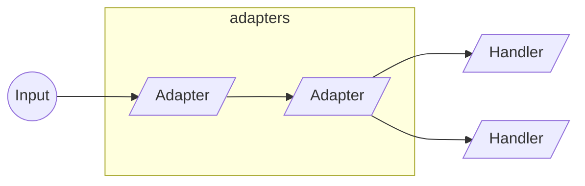
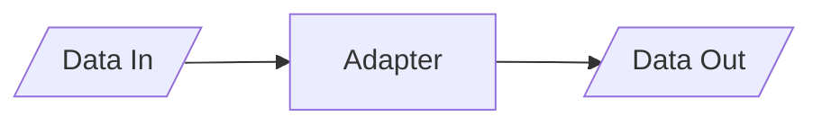
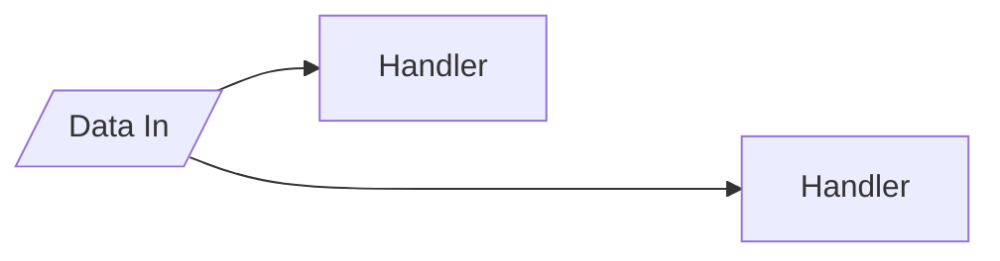
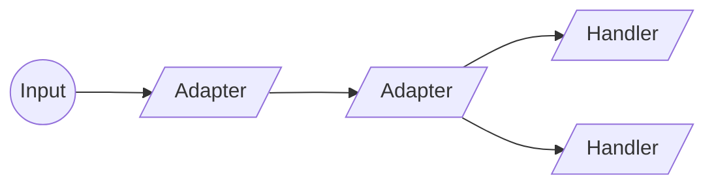

# Channels

A TCP communication library based on middleware components. Read the [official docs](https://channels.docs.faactory.io) to learn more.


[](https://channels.docs.faactory.io)

## Related Projects

The following are projects that extend the functionality of this library.

- [Parcel Protocol](https://github.com/goncalo-oliveira/channels-parcel)
- [Prometheus Metrics](https://github.com/goncalo-oliveira/channels-prometheus)
- [Teltonika Protocol](https://www.nuget.org/packages/Faactory.Channels.Teltonika)

## Design

The concept behind this library is to apply a *middleware pipeline* to data coming in and out from the open communication channels.

For data coming through the channel input, two middleware components can be applied: *adapters* and *handlers*.



For data going through the channel output, only *adapters* are applicable. Whatever comes out from the pipeline is delivered to an internal handler that writes the data to the channel's underlying socket.


## Middleware Characteristics

Unless you have very specific needs, middleware components should inherit from the abstract classes provided instead of implementing the interfaces directly. The base class for all middleware components (adapters and handlers) does a few things for us that won't be available when implementing the interfaces directly. This includes

- **Type Checking** - Ensures the data type is suitable for the middleware component. If it's not, the middleware is not executed. If the middleware is an adapter, the data is automatically forwarded to the next middleware in the pipeline. This behaviour can be changed by overriding the `OnDataNotSuitable` method.

- **Type Mutation** - The capacity to convert the data type, when compatible with the expected middleware data type. All middleware components already deal with `IByteBuffer` <--> `Byte[]` and `T` <--> `IEnumerable<T>` mutations, but they also provide an opportunity to change/extend this behaviour by overriding the `ConvertType` method.

## Adapters

An adapter is a middleware component that can be executed at any point in the pipeline and it has a single conceptual purpose: to adapt data.



An adapter is expected to *forward* data to next component in the pipeline, although that is not always the case. If an adapter doesn't forward any data, the pipeline is interrupted.

### Implementing an Adapter

Unless you have very specific needs, you should inherit your adapter from the `ChannelAdapter<T>` abstract class instead of implementing the `IChannelAdapter` interface directly.

We also need to indicate whether the adapter is meant for the input or/and the output pipelines. We do that by adding the interfaces `IInputChannelAdapter` or/and `IOutputChannelAdapter` respectively.

Here's an example of how to implement an adapter that adapts from an `IByteBuffer` (or `Byte[]`). This adapter can only be added to the input pipeline, since it only implements the `IInputChannelAdapter` interface.

```csharp
public class MyChannelAdapter : ChannelAdapter<IByteBuffer>, IInputChannelAdapter
{
    public override Task ExecuteAsync( IAdapterContext context, IByteBuffer data )
    {
        // adapt/transform data
        var adaptedData = ...

        // forward adapted data
        context.Forward( adaptedData );
    }
}
```

### Ready-made Adapters

In addition to the abstract `ChannelAdapter<T>` adapter, you have a few ready-made adapters that you can use.

| Adapter                 | Target       | Description                                        |
|-------------------------|--------------|----------------------------------------------------|
| AnonymousChannelAdapter | Input/Output | A quick way to implement an anonymous adapter      |
| BufferLengthAdapter     | Input        | Ensures the input buffer doesn't exceed in length  |

## Handlers

Although handlers are very similar to adapters, their conceptual purpose is different: to handle data. That means that business logic should be applied here and not on an adapter. Handlers are executed at the end of the pipeline and as such, they don't forward data. Unlike adapters, if more than one handler exists for a given data type, all are executed.



### Implementing an Handler

Similarly to the adapters, unless you have very specific needs, you should inherit your handler from the `ChannelHandler<T>` class and not implementing the `IChannelHandler` interface directly.

```csharp
public class MyChannelHandler : ChannelHandler<MyData>
{
    public override Task ExecuteAsync( IChannelContext context, MyData data )
    {
        // implement your handler here
    }
}
```

## Adapters vs Handlers

Because adapters and handlers are so similar, there might be a temptation to do everything with adapters. And while that's feasable, it's not recommended. Adapters should be used to adapt data and handlers to handle data (business logic).



| Adapters                               | Handlers                                  |
|----------------------------------------|-------------------------------------------|
| Adapt and forward data                 | Handle data and business logic            |
| Run at any point in the pipeline       | Run at the end of the pipeline            |
| Single adapter for forwarded data type | Multiple handlers for forwarded data type |

## Enumerable type mutation and sequence order

Before version *0.10*, the base middleware split the execution of `IEnumerable<T>` <--> `T` spreads into multiple tasks. The reason behind this was to improve the speed of execution, however, this also meant that the order of execution was not guaranteed.

Starting from version *0.10*, the base middleware executes `IEnumerable<T>` <--> `T` spreads sequentially, guaranteeing the order of execution. This decision was made because on most cases, the performance gain was negligible and the task spawning caused some confusion to implementors.

## Writing to Channel Output

At any point, within an adapter or handler, we can write data to the channel output; this will trigger the output pipeline and at the end of it, send the data to the other party. However, there are two distinct ways of doing this, both with a distinct behaviour.

### 1. Write to the Output buffer (recommended)

The middleware context gives us access to an output buffer that we can write to. This **IS** the recommended method. Writing to the output buffer doesn't immediately trigger the output pipeline. Instead, it is only triggered at the end of the (input) pipeline, after all adapters and handlers have executed (fully).
If the pipeline is interrupted, because an adapter didn't forward any data or a handler crashed, the data in the buffer will be discarded and never written to the channel.

```csharp
public override async Task ExecuteAsync( IAdapterContext context, IEnumerable<Message> data )
{
    // ...

    context.Output.Write( replyData );
}
```

### 2. Write directly to the Channel

This is the most straightforward method and it will immediately trigger the output pipeline, however, it is **NOT** the recommended way, unless you need the data to reach the other party, no matter what happens next (current or next middleware component). This is an asynchronous process.

```csharp
public override async Task ExecuteAsync( IAdapterContext context, IEnumerable<Message> data )
{
    // ...

    await context.Channel.WriteAsync( replyData );
}
```


## Getting Started

Install the package from NuGet

```bash
dotnet add package Faactory.Channels
```

To quickly bootstrap a server, we need to inject a *hosted service*. Then we need to configure the listening options and set up the input and output pipelines. Here's an example

```csharp
IServiceCollection services = ...;

// add our hosted service
services.AddChannels( channel =>
{
    // configure options
    channel.Configure( options =>
    {
        options.Port = 8080;
        options.Backlog = 30;
    } );

    // set up input pipeline
    channel.AddInputAdapter<ExampleDecoderChannelAdapter>()
        .AddInputHandler<MyChannelHandler>();

    // set up output pipeline
    channel.AddOutputAdapter<ExampleEncoderAdapter>();
} );
```

To boostrap the client, we'll need to register the factory with a service provider. Then, similarly to the server, we need to configure the channel options and set up the input and output pipelines. Here's an example

```csharp
IServiceCollection services = ...

// add our client factory
services.AddClientChannelFactory( channel =>
{
    // configure options
    channel.Configure( options =>
    {
        options.Host = "localhost";
        options.Port = 8080;
    } );
    
    // set up input pipeline
    channel.AddInputAdapter<ExampleDecoderChannelAdapter>()
        .AddInputHandler<MyChannelHandler>();

    // set up output pipeline
    channel.AddOutputAdapter<ExampleEncoderAdapter>();
} );
```

Then, where needed, we can create a client channel by using the factory

```csharp
IClientChannelFactory channelFactory = ...;
var channel = await channelFactory.CreateAsync();

await channel.WriteAsync( new MyData
{
    // ...
} );
```

## Adapters and Buffers

Although raw data handling in the adapters can be done with `Byte[]`, it is recommended to use a `IByteBuffer` instance instead, particularly for reading data. You can read more about it [here](README.buffers.md).

Data received in the adapters that is not read will remain in the channel's input buffer. When more data is received, it is delivered again along with the newly received data. If an adapter uses `Byte[]` instead, the data in the input buffer is automatically marked as read and discarded.

## Channel Scope

Every channel instance (client or service) uses its own `IServiceScope`. This means that if you add a scoped service to the DI container and use it in an adapter or handler, you'll have an unique instance per channel.

## Channel Events

In some cases, you might need to monitor channel events. This can be useful for logging, statistics or any other scenario where this information is needed. The following events are available

- Channel Created
- Channel Closed
- Data Received
- Data Sent

To receive channel events, you'll need to create a class that implements `IChannelMonitor` interface and then add it to the DI container. You can add multiple implementations and whether they are transient, scoped or singleton depends entirely on your needs.

```csharp
public class MyChannelMonitor : IChannelMonitor
{
    // ...
}

// ...

IServiceCollection services = ...;

services.AddSingleton<IChannelMonitor, MyChannelMonitor>();
```

## Channel Services

A channel service is a background service that is executed when a channel is created and stopped when it closes, sharing the same lifetime and scope as the channel. This is useful for long-running services that need to be executed within the channel scope.

The easiest way to create a channel service is to inherit from the `ChannelService` abstract class and override the `ExecuteAsync` method.

```csharp
public class MyService : ChannelService
{
    protected override async Task ExecuteAsync( CancellationToken cancellationToken )
    {
        while ( !cancellationToken.IsCancellationRequested )
        {
            // insert code...

            /*
            here we have access to the channel instance through the Channel property
            */

            // await Channel.WriteAsync( ... );

            await Task.Delay( 1000 );
        }
    }
}
```

If you have other specific needs, you can also implement the `IChannelService` interface directly.

```csharp
public class MyService : IChannelService
{
    // ...

    public Task StartAsync( IChannel channel, CancellationToken cancellationToken )
    {
        // Invoked when a channel is created
    }

    public Task StopAsync( CancellationToken cancellationToken )
    {
        // Invoked when a channel is closed
    }

    public void Dispose()
    { }
}
```

The service is added by using the builder's `AddChannelService` method.

```csharp
IChannelBuilder channel = ...;

chanel.AddChannelService<MyService>();
```

## Channel Data

It is possible to store custom data on a channel instance. The `IChannel` interface exposes a `Data` property, which is essentially a case-insensitive string dictionary. This can be useful for storing data that is used later by other adapters and handlers.

```csharp
public class SampleIdentityHandler : ChannelHandler<IdentityInformation>
{
    public override Task ExecuteAsync( IChannelContext context, IdentityInformation data )
    {
        if ( !IsAuthorized( data ) )
        {
            return context.Channel.CloseAsync();
        }

        /*
        store the UUID on the channel data for later use
        */
        context.Channel.Data["uuid"] = data.UUId;

        return Task.CompletedTask;
    }
}
```

## Idle Channels

> [!NOTE]
> On previous releases, the idle detection mechanism was available and active by default. Since version 0.5 this is no longer true and the idle detection service needs to be added explicitly.

There's a ready-made service that monitors channel activity and detects if a channel has become idle or unresponsive. When that happens, the underlying socket is disconnected and the channel closed.

To enable this service, just add it as a channel service using the builder extensions

```csharp
IChannelBuilder channel = ...;

channel.AddIdleChannelService();
```

The default detection mode is `IdleDetectionMode.Auto`, which attempts to actively verify if the underlying socket is still connected and if not, closes the channel.

There's also a hard timeout of 60 seconds by default; if no data is received or sent through the underlying socket before the timeout, the channel is closed. This timeout can be disabled when using the `IdleDetectionMode.Auto` method by setting its value to `TimeSpan.Zero`.

```csharp
IChannelBuilder channel = ...;

channel.AddIdleChannelService( options =>
{
    // these are the default settings; added here just for clarity
    options.DetectionMode = IdleDetectionMode.Auto;
    options.Timeout = TimeSpan.FromSeconds( 60 );
    // to use Auto method without the hard timeout
    //options.Timeout = TimeSpan.Zero;
} );
```

Other detection modes only use the hard timeout on received and.or sent data.

```csharp
IChannelBuilder channel = ...;

channel.AddIdleChannelService( options =>
{
    // timeout (30s) to both received and sent data
    options.DetectionMode = IdleDetectionMode.Both;
    options.Timeout = TimeSpan.FromSeconds( 30 );
} );
```

The recommended detection mode depends on the nature of the communication and the specific requirements of the application. For most cases, the `IdleDetectionMode.Auto` is a good choice. If the quality of the connection is known to be poor (particularly mobile networks), applying a hard timeout on received and/or sent data might be more reliable.
