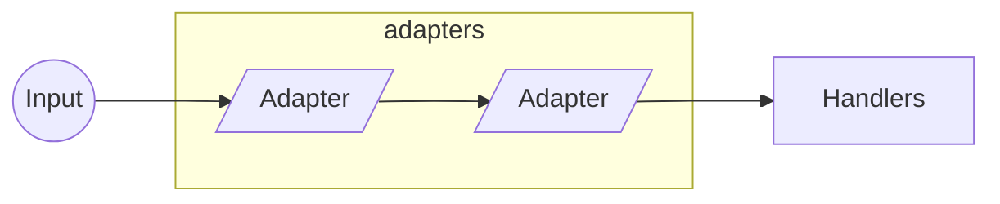
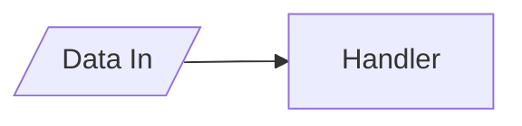

# Channels

A TCP communication library based on middleware components.

## Design

The concept behind this library is to apply a *middleware pipeline* to data coming in and out from the open communication channels.

For data coming through the channel input, two middleware components can be applied: *adapters* and *handlers*.



For data going through the channel output, only *adapters* are applicable.


## Adapters

An adapter is a middleware component that can be executed at any point in the pipeline and it has a single conceptual purpose: to adapt data.


An adapter is expected to *forward* data to next component in the pipeline, although that is not mandatory. However, if the adapter doesn't forward any data, the pipeline is interrupted and no other components will be executed.

### Implementing an Adapter

Unless you have specific needs, you should inherit your adapter from `ChannelAdapter<T>` class and not from the `IChannelAdapter` interface directly. This is because the base class does a few things for us that, if implemented from the interface directly, won't be available. That includes

- Type checking
- Type mutation

Type checking is essentially making sure the type of the data is intended for an adapter. If it's not, data is automatically forwarded to the next middleware component in the pipeline.

Type mutation is the capacity to transform the data type, if compatible with the expected data of the adapter. The base class already deals with `IByteBuffer` and `Byte[]` mutation, but it also provides an opportunity to extend the behaviour.

Here's an example of how to implement an adapter.

```csharp
public class MyChannelAdapter : ChannelAdapter<IByteBuffer>
{
    public override Task ExecuteAsync( IAdapterContext context, IByteBuffer data )
    {
        // adapt/transform data
        var adaptedData = ...

        // forward adapted data
        context.Forward( adaptedData );
    }
}
```

## Handlers

Although handlers are very similar to adapters, their conceptual purpose is different: to handle data. That means that business logic should be applied here and not on an adapter. Also, handlers are executed at the end of the pipeline and as such, they don't forward data.



### Implementing an Handler

Similarly to the adapter, unless you have specific needs, you should inherit your handler from the `ChannelHandler<T>` class and not the `IChannelHandler` interface directly. This is because, again, similarly to the adapter, the base class does a type checking for us; if the data type is not intended for the handler, then it (the handler) won't be executed.

```csharp
public class MyChannelHandler : ChannelHandler<MyData>
{
    public override Task ExecuteAsync( IChannelContext context, MyData data )
    {
        // implement your handler here
    }
}
```

## Adapters vs Handlers

Because adapters and handlers are so similar, there might be a temptation to do everything with adapters. And while that's feasable, it's not recommended. Adapters should be used to adapt data and handlers to handle data (business logic).

- Adapters adapt and forward data
- Handlers handle data and business logic
- Adapters run at any point in the pipeline
- Handlers run at the end of the pipeline

## Writing to Output

At any point, within an adapter or handler, we can write data to the channel output; this will trigger the output pipeline and at the end, send the data to the other party. However, there are two distinct ways that behave differently.

### 1. Write directly to the Channel

This is the most straightforward method and it will immediately trigger the output pipeline, but it is not the recommended way, unless you need the data to reach the other party as soon as possible, no matter what happens next (current or next middleware component).

```csharp
public override async Task ExecuteAsync( IAdapterContext context, IEnumerable<Message> data )
{
    // ...

    await context.Channel.WriteAsync( replyData );
}
```

### 2. Write through the Output buffer (recommended)

The context of an adapter or handler, contains an output buffer where we can write to. The written data doesn't immediately trigger the output pipeline. Instead, it is only triggered at the end of the pipeline, after all adapters and handlers have executed - without interruption. If an adapter interrupts the pipeline, or a handler crashes and interrupts the pipeline, the data in the buffer will never be written to the channel.

```csharp
public override async Task ExecuteAsync( IAdapterContext context, IEnumerable<Message> data )
{
    // ...

    context.Output.Write( replyData );
}
```

## Getting Started

Install the package from NuGet

```bash
dotnet add package Faactory.Channels
```

To quickly bootstrap a server, we need a `HostBuilder` to inject a *hosted service*. Then we need to configure the listening options and set up the input and output pipelines. Here's an example

```csharp
var builder = new HostBuilder()
    .ConfigureServices( ( context, services) =>
    {
        // add logging
        services.AddLogging( loggingBuilder =>
        {
            loggingBuilder.AddConsole()
                .SetMinimumLevel( LogLevel.Debug );
        } );

        // add our hosted service
        services.AddChannelsHostedService( builder =>
        {
            // configure options
            builder.Configure( options =>
            {
                options.Port = 8080;
                options.Backlog = 30;
            } );

            // set up input pipeline
            builder.AddInputAdapter<ExampleDecoderChannelAdapter>()
                .AddInputHandler<MyChannelHandler>();

            // set up output pipeline
            builder.AddOutputAdapter<ExampleEncoderAdapter>();
        } );
    } )
    .UseConsoleLifetime();

await builder.Build().RunAsync();
```

To boostrap the client, we'll need to register the factory with a service provider. Then, similarly to the server, we need to configure the channel options and set up the input and output pipelines. Here's an example

```csharp
IServiceCollection services = ...

// add logging
services.AddLogging( loggingBuilder =>
{
    loggingBuilder.AddConsole()
        .SetMinimumLevel( LogLevel.Debug );
} );

services.AddChannelsClient( builder =>
{
    builder.Configure( options =>
    {
        options.Host = "localhost";
        options.Port = 8080;
    } );
    
    // set up input pipeline
    builder.AddInputAdapter<ExampleDecoderChannelAdapter>()
        .AddInputHandler<MyChannelHandler>();

    // set up output pipeline
    builder.AddOutputAdapter<ExampleEncoderAdapter>();
} );

var provider = services.BuildServiceProvider();
var channelFactory = provider.GetRequiredService<IClientChannelFactory>();
var channel = await channelFactory.CreateAsync();

await channel.WriteAsync( new MyData
{
    // ...
} );
```

## Adapters and Buffers

Although raw data handling in the adapters can be done with `Byte[]`, it is recommended to use an `IByteBuffer` instance instead, particularly for reading data. You can read more about it [here](src/buffers/README.md).

## Parcel Protocol

If you intend to use [Parcel Protocol](https://github.com/goncalo-oliveira/parcel-spec) for communication, you have available an extension library. You can read more about it [here](src/parcel-channels-protocol/README.md).
