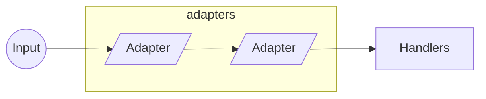
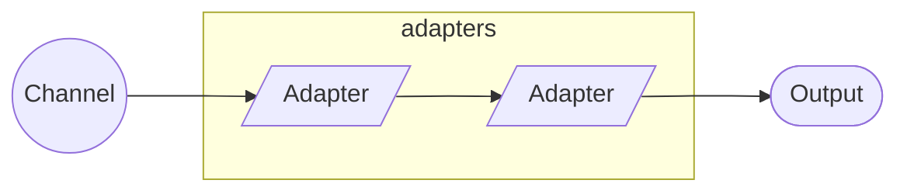
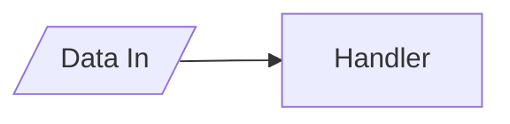

# Channels

A TCP communication library based on middleware components.


## Design

The concept behind this library is to apply a *middleware pipeline* to data coming in and out from the open communication channels.

For data coming through the channel input, two middleware components can be applied: *adapters* and *handlers*.



For data going through the channel output, only *adapters* are applicable.



## Middleware Characteristics

Unless you have very specific needs, middleware components should inherit from the abstract classes provided instead of implementing the interfaces directly. The base class for all middleware components (adapters and handlers) do a few things for us that won't be available when implementing the interfaces directly. This includes

- Type checking
- Type mutation

Type checking is essentially making sure the type of the data received is intended for the middleware. If it's not, the middleware component is not executed. If the component is an adapter, the data is automatically forwarded to the next middleware component in the pipeline.

Type mutation is the capacity to change the data type, if compatible with the expected data of the middleware component. All components already deal with `IByteBuffer` <--> `Byte[]` and `T` <--> `IEnumerable<T>` mutations, but they also provide an opportunity to change/extend this behaviour by overriding the `ConvertData` method.

## Adapters

An adapter is a middleware component that can be executed at any point in the pipeline and it has a single conceptual purpose: to adapt data.


An adapter is expected to *forward* data to next component in the pipeline, although that is not a requirement. If an adapter doesn't forward any data, the pipeline is interrupted and no other components will be executed.

### Implementing an Adapter

Unless you have very specific needs, you should inherit your adapter from the `ChannelAdapter<T>` abstract class instead of implementing the `IChannelAdapter` interface directly.

Since version 0.3 we also need to indicate whether the adapter is meant for the input or/and the output pipelines. We do that by adding the interfaces `IInputChannelAdapter` or/and `IOutputChannelAdapter` respectively.

Here's an example on how to implement an adapter that adapts from an `IByteBuffer` (or `Byte[]`). This adapter can only be added to the input pipeline.

```csharp
public class MyChannelAdapter : ChannelAdapter<IByteBuffer>, IInputChannelAdapter
{
    public override Task ExecuteAsync( IAdapterContext context, IByteBuffer data )
    {
        // adapt/transform data
        var adaptedData = ...

        // forward adapted data
        context.Forward( adaptedData );
    }
}
```

### Ready-made Adapters

In addition to the abstract `ChannelAdapter<T>` adapter, you have a few more ready-made adapters that you can use.

| Adapter                 | Target       | Description                                        |
|-------------------------|--------------|----------------------------------------------------|
| AnonymousChannelAdapter | Input/Output | A quick way to implement an anonymous adapter      |
| BufferLengthAdapter     | Input        | Ensures the input buffer doesn't exceed in length  |

## Handlers

Although handlers are very similar to adapters, their conceptual purpose is different: to handle data. That means that business logic should be applied here and not on an adapter. Also, handlers are executed at the end of the pipeline and as such, they don't forward data.



### Implementing an Handler

Similarly to the adapter, unless you have very specific needs, you should inherit your handler from the `ChannelHandler<T>` class and not implementing the `IChannelHandler` interface directly.

```csharp
public class MyChannelHandler : ChannelHandler<MyData>
{
    public override Task ExecuteAsync( IChannelContext context, MyData data )
    {
        // implement your handler here
    }
}
```

## Adapters vs Handlers

Because adapters and handlers are so similar, there might be a temptation to do everything with adapters. And while that's feasable, it's not recommended. Adapters should be used to adapt data and handlers to handle data (business logic).

- Adapters adapt and forward data
- Handlers handle data and business logic
- Adapters can run at any point in the pipeline
- Handlers run at the end of the pipeline
- Data with type T is forwarded to the next (single) adapter in the pipeline
- Data with type T can be forwarded to multiple handlers

## Enumerable type mutation and sequence order

As said before, the base class for both adapters and handlers deals with `T` <--> `IEnumerable<T>` mutations. This is helpful to focus on how we want to deal with data (particularly in handlers), however, there are a few things to consider.

When the middleware expects `T` and receives `IEnumerable<T>` instead, by default, the execution is spawned through multiple tasks. The benefit of this is that the execution is usually faster, but the downside is that there's no guarantee the data is executed sequentially (FIFO).

```csharp
public class MyHandler : ChannelHandler<MyData>
{
    public override Task ExecuteAsync( IChannelContext context, MyData data )
    {
        /*
        if MyData[] is sent to the handler, this method is spawned through multiple threads
        to improve speed but there's no guarantee on the order of the execution
        */
    }
}
```

If the middleware we are implementing (adapter or handler) requires data to be processed sequentially (FIFO), it should instead implement `T[]` (or `IEnumerable<T>`) and manually cycle through the elements

```csharp
public class MyHandler : ChannelHandler<MyData[]>
{
    public override async Task ExecuteAsync( IChannelContext context, MyData[] data )
    {
        foreach ( var item in data )
        {
            await ExecuteSingleAsync( context, item );
        }
    }

    private Task ExecuteSingleAsync( IChannelContext context, MyData data )
    {
        // ...
    }
}
```

## Writing to Channel Output

At any point, within an adapter or handler, we can write data to the channel output; this will trigger the output pipeline and at the end of it, send the data to the other party. However, there are two distinct ways of doing this, both with a distinct behaviour.

### 1. Write directly to the Channel

This is the most straightforward method and it will immediately trigger the output pipeline, however, it is **NOT** the recommended way, unless you need the data to reach the other party as soon as possible, no matter what happens next (current or next middleware component). This is an asynchronous process.

```csharp
public override async Task ExecuteAsync( IAdapterContext context, IEnumerable<Message> data )
{
    // ...

    await context.Channel.WriteAsync( replyData );
}
```

### 2. Write to the Output buffer (recommended)

The middleware component context gives us access to an output buffer that we can write to. This **IS** the recommended method. Writing to the output buffer doesn't immediately trigger the output pipeline. Instead, it is only triggered at the end of the pipeline, after all adapters and handlers have executed (fully).
If the pipeline is interrupted, because an adapter didn't forward any data or a handler crashed, the data in the buffer will never be written to the channel.

```csharp
public override async Task ExecuteAsync( IAdapterContext context, IEnumerable<Message> data )
{
    // ...

    context.Output.Write( replyData );
}
```

## Getting Started

Install the package from NuGet

```bash
dotnet add package Faactory.Channels
```

To quickly bootstrap a server, we need an `HostBuilder` to inject a *hosted service*. Then we need to configure the listening options and set up the input and output pipelines. Here's an example

```csharp
var builder = new HostBuilder()
    .ConfigureServices( ( context, services) =>
    {
        // add logging
        services.AddLogging( loggingBuilder =>
        {
            loggingBuilder.AddConsole()
                .SetMinimumLevel( LogLevel.Debug );
        } );

        // add our hosted service
        services.AddChannelsHostedService( builder =>
        {
            // configure options
            builder.Configure( options =>
            {
                options.Port = 8080;
                options.Backlog = 30;
            } );

            // set up input pipeline
            builder.AddInputAdapter<ExampleDecoderChannelAdapter>()
                .AddInputHandler<MyChannelHandler>();

            // set up output pipeline
            builder.AddOutputAdapter<ExampleEncoderAdapter>();
        } );
    } )
    .UseConsoleLifetime();

await builder.Build().RunAsync();
```

To boostrap the client, we'll need to register the factory with a service provider. Then, similarly to the server, we need to configure the channel options and set up the input and output pipelines. Here's an example

```csharp
IServiceCollection services = ...

// add logging
services.AddLogging( loggingBuilder =>
{
    loggingBuilder.AddConsole()
        .SetMinimumLevel( LogLevel.Debug );
} );

// add our client factory
services.AddChannelsClient( builder =>
{
    // configure options
    builder.Configure( options =>
    {
        options.Host = "localhost";
        options.Port = 8080;
    } );
    
    // set up input pipeline
    builder.AddInputAdapter<ExampleDecoderChannelAdapter>()
        .AddInputHandler<MyChannelHandler>();

    // set up output pipeline
    builder.AddOutputAdapter<ExampleEncoderAdapter>();
} );

var provider = services.BuildServiceProvider();
var channelFactory = provider.GetRequiredService<IClientChannelFactory>();
var channel = await channelFactory.CreateAsync();

await channel.WriteAsync( new MyData
{
    // ...
} );
```

## Adapters and Buffers

Although raw data handling in the adapters can be done with `Byte[]`, it is recommended to use a `IByteBuffer` instance instead, particularly for reading data. You can read more about it [here](src/buffers/README.md).

## Service Scope

Every channel instance (client or service) uses a new `IServiceScope`. This means that if you add a scoped service to the DI container and use it in an adapter or handler, you'll have a unique instance per channel.

## Channel Events

In some cases, you might need to tap into channel events. This can be useful for logging, statistics or a custom scenario. The following events are available

- Channel Created
- Channel Closed
- Data Received
- Data Sent

To receive channel events, you'll need to create a class that implements `IChannelEvents` interface and then add it to the DI container. You can add multiple implementations.

```csharp
public class MyChannelEvents : IChannelEvents
{
    // ...
}

// ...

IServiceCollection services = ...;

services.AddTransient<IChannelEvents, MyChannelEvents>();
```

## Channel Services

Sometimes it might be required to execute a long-running service inside a channel. This can be achieved by creating a class that implements `IChannelService` interface.

```csharp
public class MyService : IChannelService
{
    // ...

    public void Start( IChannel channel )
    {
        // This is invoked when a channel is created
    }

    public void Stop()
    {
        // This is invoked when a channel is closed
    }
}
```

To set up the service we can use the channel builder extensions

```csharp
IChannelBuilder builder = ...;

builder.AddService<MyService>();
```

## Idle Channels

> On previous releases, the idle detection mechanism was available and active by default. Since version 0.5 this is no longer true and the idle detection service needs to be added.

There's a ready-made service that monitors channels activity and detects if a channel has become idle or unresponsive. When that happens, the underlying socket is disconnected and the channel closed.

To enable this service, just add it as a channel service using the builder extensions

```csharp
IChannelBuilder builder = ...;

builder.AddIdleChannelService();
```

The default detection mode is `IdleDetectionMode.Auto`. This mode attempts to actively verify if the underlying socket is still connected and if not, closes the channel.

There's also an idle timeout of 60 seconds by default; if no data is received or sent through the underlying socket before the timeout, the channel is closed. This timeout can be disabled when using the `IdleDetectionMode.Auto` method by setting its value to `TimeSpan.Zero`.

```csharp
IChannelBuilder builder = ...;

builder.AddIdleChannelService( options =>
{
    // these are the default settings; added here just for clarity
    options.DetectionMode = IdleDetectionMode.Auto;
    options.Timeout = TimeSpan.FromSeconds( 60 );
    // to use Auto method without the hard timeout
    //options.Timeout = TimeSpan.Zero;
} );
```

Other detection modes only use the timeout on received or sent data (or both).

```csharp
IChannelBuilder builder = ...;

builder.AddIdleChannelService( options =>
{
    // timeout (30s) to both received and sent data
    options.DetectionMode = IdleDetectionMode.Both;
    options.Timeout = TimeSpan.FromSeconds( 30 );
} );
```

## Protocol Extensions

The following are available as protocol extensions built for Channels.

- [Parcel](https://github.com/goncalo-oliveira/channels-parcel)
- [Teltonika](https://www.nuget.org/packages/Faactory.Channels.Teltonika)
