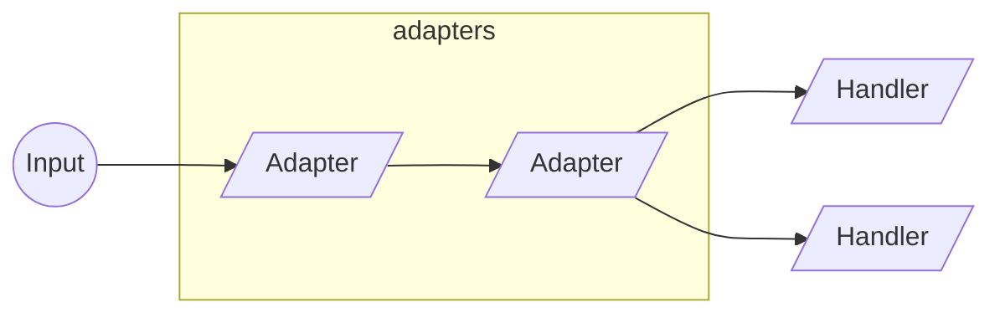
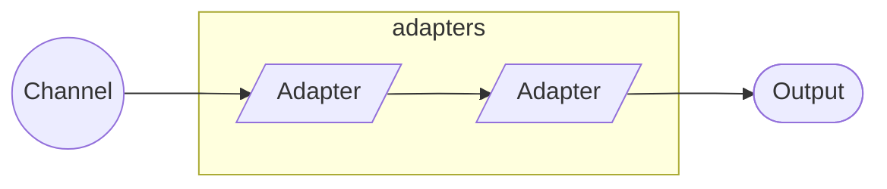
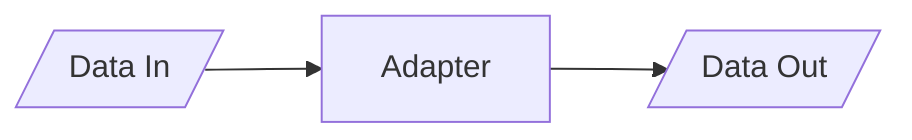
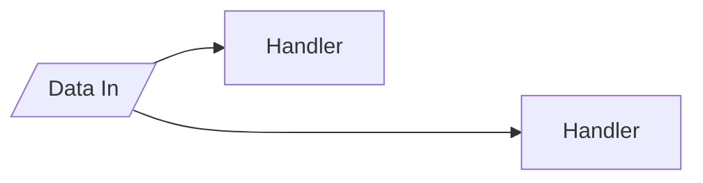
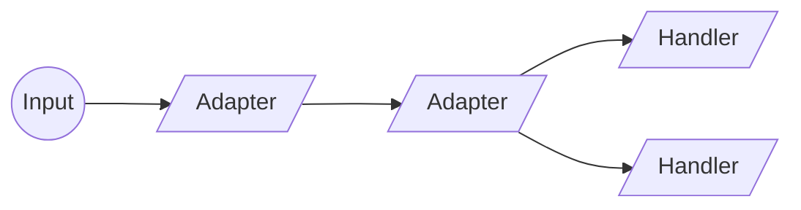

# Channels

A middleware-based communication library for TCP, UDP, and WebSockets. Read the [official docs](https://channels.docs.faactory.io) to learn more.


[](https://channels.docs.faactory.io)

## Design

The concept behind this library is to apply a *middleware pipeline* to data coming in and out from the open communication channels.

For data coming through the channel input, two middleware components can be applied: *adapters* and *handlers*.


```mermaid
graph LR;
    channelInput((Input)) --> a1[/Adapter/]
    subgraph adapters
    a1 --> a2[/Adapter/]
    end
    a2 --> h1[/Handler/]
    a2 --> h2[/Handler/]
```

For data going through the channel output, only *adapters* are applicable. Whatever comes out from the pipeline is delivered to a built-in handler that writes the data to the channel's underlying transport.


```mermaid
graph LR;
    openChannel((Channel)) --> a1[/Adapter/]
    subgraph adapters
    a1 --> a2[/Adapter/]
    end
    a2 --> channelOutput([Output])
```

> [!IMPORTANT]
> If an adapter or handler throws an exception, the channel is closed. This is a safety mechanism to prevent the channel from being in an inconsistent state. If you need to handle exceptions differently, you can catch them within the adapter or handler and handle them accordingly.

## Middleware Characteristics

Unless you have very specific needs, middleware components should inherit from the abstract classes provided instead of implementing the interfaces directly. The base class for all middleware components (adapters and handlers) does a few things for us that won't be available when implementing the interfaces directly. This includes

- **Type Checking** - Ensures the data type is suitable for the middleware component. If it's not, the middleware is not executed. If the middleware is an adapter, the data is automatically forwarded to the next middleware in the pipeline. This behaviour can be changed by overriding the `OnDataNotSuitable` method.

- **Type Mutation** - The capacity to convert the data type, when compatible with the expected middleware data type. All middleware components already deal with `IReadableByteBuffer` <--> `byte[]` and `T` <--> `IEnumerable<T>` mutations, but they also provide an opportunity to change/extend this behaviour by overriding the `ConvertType` method.

## Adapters

An adapter is a middleware component that can be executed at any point in the pipeline and it has a single conceptual purpose: to adapt data.


```mermaid
graph LR;
    in[/Data In/] --> Adapter --> out[/Data Out/]
```

An adapter is expected to *forward* data to next component in the pipeline, although that is not always the case. If an adapter doesn't forward any data, the pipeline is interrupted.

### Implementing an Adapter

Unless you have very specific needs, you should inherit your adapter from the `ChannelAdapter<T>` abstract class instead of implementing the `IChannelAdapter` interface directly.

We also need to indicate whether the adapter is meant for the input or/and the output pipelines. We do that by adding the interfaces `IInputChannelAdapter` or/and `IOutputChannelAdapter` respectively.

Here's an example of how to implement an adapter that adapts from an `IReadableByteBuffer` (or `byte[]`). This adapter can only be added to the input pipeline, since it only implements the `IInputChannelAdapter` interface.

```csharp
public class MyChannelAdapter : ChannelAdapter<IReadableByteBuffer>, IInputChannelAdapter
{
    public override Task ExecuteAsync( IAdapterContext context, IReadableByteBuffer data, CancellationToken cancellationToken )
    {
        // adapt/transform data
        var adaptedData = ...

        // forward adapted data
        context.Forward( adaptedData );
    }
}
```

### Ready-made Adapters

In addition to the abstract `ChannelAdapter<T>` adapter, you have a few ready-made adapters that you can use.

| Adapter                 | Target       | Description                                        |
|-------------------------|--------------|----------------------------------------------------|
| AnonymousChannelAdapter | Input/Output | A quick way to implement an anonymous adapter      |
| BufferLengthAdapter     | Input        | Ensures the input buffer doesn't exceed in length  |

## Handlers

Although handlers are very similar to adapters, their conceptual purpose is different: to handle data. That means that business logic should be applied here and not on an adapter. Handlers are executed at the end of the pipeline and as such, they don't forward data. Unlike adapters, if more than one handler exists for a given data type, all are executed.


```mermaid
graph LR;
    in[/Data In/] --> H1[Handler]
    in ----> H2[Handler]
```

### Implementing an Handler

Similarly to the adapters, unless you have very specific needs, you should inherit your handler from the `ChannelHandler<T>` class and not implementing the `IChannelHandler` interface directly.

```csharp
public class MyChannelHandler : ChannelHandler<MyData>
{
    public override Task ExecuteAsync( IChannelContext context, MyData data, CancellationToken cancellationToken )
    {
        // implement your handler here
    }
}
```

## Adapters vs Handlers

Because adapters and handlers are so similar, there might be a temptation to do everything with adapters. And while that's feasable, it's not recommended. Adapters should be used to adapt data and handlers to handle data (business logic).


```mermaid
graph LR;
    channelInput((Input)) --> a1[/Adapter/]
    a1 --> a2[/Adapter/]
    a2 --> h1[/Handler/]
    a2 --> h2[/Handler/]
```

| Adapters                               | Handlers                                  |
|----------------------------------------|-------------------------------------------|
| Adapt and forward data                 | Handle data and business logic            |
| Run at any point in the pipeline       | Run at the end of the pipeline            |
| Single adapter for forwarded data type | Multiple handlers for forwarded data type |

## Enumerable Type Handling

When middleware produces an `IEnumerable<T>` and the next middleware component consumes `T`, each item is processed sequentially, guaranteeing that the order of execution is preserved.

This ensures predictable behavior while keeping middleware composition flexible.

## Writing to Channel Output

At any point, within an adapter or handler, we can write data to the channel output; this will trigger the output pipeline and at the end of it, send the data through the underlying transport. However, there are two distinct ways of doing this, both with a distinct behaviour.

### 1. Write to the Output buffer (recommended)

The middleware context gives us access to an output buffer that we can write to. This **IS** the recommended method. Writing to the output buffer doesn't immediately trigger the output pipeline. Instead, it is only triggered at the end of the (input) pipeline, after all adapters and handlers have executed (fully).
If the pipeline is interrupted, because an adapter didn't forward any data, the data in the buffer will be discarded and never written to the channel.

```csharp
public override async Task ExecuteAsync( IAdapterContext context, IEnumerable<Message> data, CancellationToken cancellationToken )
{
    // ...

    context.Output.Write( replyData );
}
```

### 2. Write directly to the Channel

This is the most straightforward method and it will immediately trigger the output pipeline, however, it is **NOT** the recommended way, unless you need the data to be immediately sent through the underlying transport, no matter what happens next (current or next middleware component). This is an asynchronous process.

```csharp
public override async Task ExecuteAsync( IAdapterContext context, IEnumerable<Message> data, CancellationToken cancellationToken )
{
    // ...

    await context.Channel.WriteAsync( replyData );
}
```


## Getting Started

Install the package from NuGet

```bash
dotnet add package Faactory.Channels
```

The first step is to add the library to the DI container and configure the channel pipelines. These configurations are always *named*, which means that we can have multiple channel configurations for different purposes. Nonetheless, if we only need one channel pipeline, we can do it all at once by setting a *default* configuration.

```csharp
IServiceCollection services = ...;

// add our hosted service
services.AddChannels( channel =>
{
    // set up input pipeline
    channel.AddInputAdapter<ExampleAdapter>()
        .AddInputHandler<ExampleHandler>();

    // set up output pipeline
    channel.AddOutputAdapter<ExampleAdapter>();
} );
```

If we need to configure multiple channel pipelines, we use the parameterless method, which returns a builder that allows us to configure named channels.

```csharp
IServiceCollection services = ...;

services.AddChannels()
    .Add( "channel1", channel =>
    {
        // set up input pipeline
        channel.AddInputAdapter<ExampleAdapter>()
            .AddInputHandler<ExampleHandler1>();

        // set up output pipeline
        channel.AddOutputAdapter<ExampleAdapter>();
    } )
    .Add( "channel2", channel =>
    {
        // set up input pipeline
        channel.AddInputAdapter<ExampleAdapter>()
            .AddInputHandler<ExampleHandler2>();

        // set up output pipeline
        channel.AddOutputAdapter<ExampleAdapter>();
    } );
```

## Listeners

After the channels are configured, we need to add the listener services. The library provides listeners for TCP and UDP channels. When adding a listener, we can specify the channel name and the options, or we can use the default channel configuration.

```csharp
IServiceCollection services = ...;

services.AddTcpChannelListener( 8080 );                // TCP listener with default channel configuration
// services.AddTcpChannelListener( "channel1", 8080 ); // TCP listener with named channel configuration
// services.AddUdpChannelListener( 7701 );             // UDP listener with default channel configuration
```

We can use multiple listeners in the same application, each with its own configuration.

## Adapters and Buffers

Although raw data handling in adapters can be done with `byte[]`, it is strongly recommended to use `IReadableByteBuffer`, particularly for reading and framing scenarios.

### Input Buffer Behavior

Data delivered to the input pipeline is provided as an `IReadableByteBuffer`.

This buffer is a **windowed view** over the channel’s internal buffer:

- It does **not allocate**
- It shares the underlying memory
- Only the unread portion is exposed

Unread bytes are preserved between pipeline executions. If the pipeline does not fully consume the buffer, those unread bytes remain and will be delivered again when more data arrives.

This makes `IReadableByteBuffer` the preferred option for:

- Framing protocols
- Partial reads
- Incremental decoding

> [!IMPORTANT]
> The buffer provided to the pipeline is a **view**, not a copy.
>
> If you need to retain data beyond the current pipeline execution,
> you must create a copy:
>
> ```csharp
> var snapshot = buffer.ToArray();
> ```

Failing to do so may result in unexpected behavior, as the underlying buffer may be compacted or reused after the pipeline completes.

### Using `byte[]` Instead

If an adapter consumes `byte[]` instead of `IReadableByteBuffer`, the internal input buffer is treated as **fully consumed** before the adapter runs. This means partial reads aren’t possible with `byte[]`, and any unprocessed data will be lost.

For this reason, unless you have a specific reason to use `byte[]`, `IReadableByteBuffer` is preferred and recommended for most input scenarios.

### Output Pipeline and Buffers

The output pipeline is more permissive.

The following types are supported:

- `byte[]`
- `IByteBuffer`
- `IReadableByteBuffer`
- `IWritableByteBuffer`

Buffers passed through the output pipeline may be views or writable instances. At the end of the pipeline, they are written to the underlying transport.

## Channel Scope

Every channel instance (client or service) uses its own `IServiceScope`. This means that if you add a scoped service to the DI container and use it in an adapter or handler, you'll have an unique instance per channel.

## Channel Events

In some cases, you might need to monitor channel events. This can be useful for logging, statistics or any other scenario where this information is needed. The following events are available

- Channel Created
- Channel Closed
- Data Received
- Data Sent

To receive channel events, you'll need to create a class that implements `IChannelMonitor` interface and then add it to the DI container. You can add multiple implementations and whether they are transient, scoped or singleton depends entirely on your needs.

```csharp
public class MyChannelMonitor : IChannelMonitor
{
    // ...
}

// ...

IServiceCollection services = ...;

services.AddSingleton<IChannelMonitor, MyChannelMonitor>();
```

## Channel Services

A channel service is a background service that is executed when a channel is created and stopped when it closes, sharing the same lifetime and scope as the channel. This is useful for long-running services that need to be executed within the channel scope.

The easiest way to create a channel service is to inherit from the `ChannelService` abstract class and override the `ExecuteAsync` method.

```csharp
public class MyService : ChannelService
{
    protected override async Task ExecuteAsync( CancellationToken cancellationToken )
    {
        while ( !cancellationToken.IsCancellationRequested )
        {
            // insert code...

            /*
            here we have access to the channel instance through the Channel property
            */

            // await Channel.WriteAsync( ... );

            await Task.Delay( 1000 );
        }
    }
}
```

If you have other specific needs, you can also implement the `IChannelService` interface directly.

```csharp
public class MyService : IChannelService
{
    // ...

    public Task StartAsync( IChannel channel, CancellationToken cancellationToken )
    {
        // Invoked when a channel is created
    }

    public Task StopAsync( CancellationToken cancellationToken )
    {
        // Invoked when a channel is closed
    }

    public void Dispose()
    { }
}
```

The service is added by using the builder's `AddChannelService` method.

```csharp
IChannelBuilder channel = ...;

channel.AddChannelService<MyService>();
```

## Channel Data

It is possible to store custom data on a channel instance. The `IChannel` interface exposes a `Data` property, which is essentially a case-insensitive string dictionary. This can be useful for storing data that is used later by other adapters and handlers.

```csharp
public class SampleIdentityHandler : ChannelHandler<IdentityInformation>
{
    public override Task ExecuteAsync( IChannelContext context, IdentityInformation data, CancellationToken cancellationToken )
    {
        if ( !IsAuthorized( data ) )
        {
            return context.Channel.CloseAsync();
        }

        /*
        store the UUID on the channel data for later use
        */
        context.Channel.Data["uuid"] = data.UUId;

        return Task.CompletedTask;
    }
}
```

## Idle Channels

By default, channels are initialized with an idle detection mechanism that closes the channel if no data is received or sent after a certain amount of time, which defaults to 60 seconds. This mechanism can be disabled or customized through the channel options.

```csharp
IServiceCollection services = ...;

services.AddChannels( channel =>
{
    channel.Configure( options =>
    {
        // this is the default setting; added here just for clarity
        options.IdleTimeout = TimeSpan.FromSeconds( 60 );
    } );

    // ...
} );
```

To disable the idle detection mechanism, set the `IdleTimeout` property to `TimeSpan.Zero`.

> [!TIP]
> The idle detection mechanism is available for all channel types: TCP, UDP and WebSockets.

## Client

The library also provides a TCP/UDP client that can be used to connect to a server. This client automatically connects to the server and creates a channel instance when the connection is established. Connection drops are automatically handled and the client will attempt to reconnect.

Clients use the same channel configuration as the listeners, but they require additional configuration.

```csharp
IServiceCollection services = ...;

/*
this registers a default client with the default channel configuration
*/
services.AddChannelsClient( "tcp://example.host:8080" );

/*
we could also register the default client with a named channel configuration
*/
// services.AddChannelsClient( "channel1", "tcp://example.host:8080" );

/*
when we need to create a client, we only need to inject the `IChannelFactory` interface
*/
public class MyClient
{
    private readonly IChannelsClient client;

    public MyClient( IChannelFactory factory )
    {
        client = factory.CreateClientChannel();
    }

    public Task ExecuteAsync()
    {
        // ...
    }
}
```

If we need to configure multiple clients with different channel configurations, we need to register them as named clients instead.

```csharp
IServiceCollection services = ...;

/*
this registers a named client (client1) with the default channel configuration
*/
services.AddChannelsNamedClient( "client1", "tcp://example.host:8080" );

/*
this registers a named client (client2) with a named channel configuration (channel1)
*/
services.AddChannelsNamedClient( "client2", "channel1", "tcp://example.host:8080" );
```

## Web Sockets

Support for web sockets is available through the `Faactory.Channels.WebSockets` package. It provides ASP.NET Core routing and middleware for easy integration with this library. Read more about it [here](README.websockets.md).
