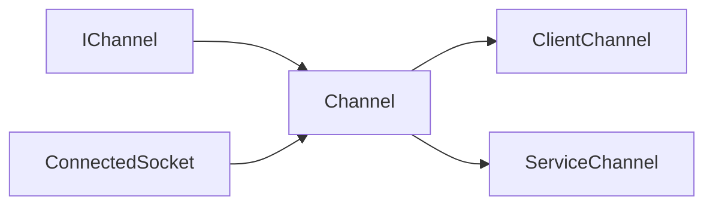
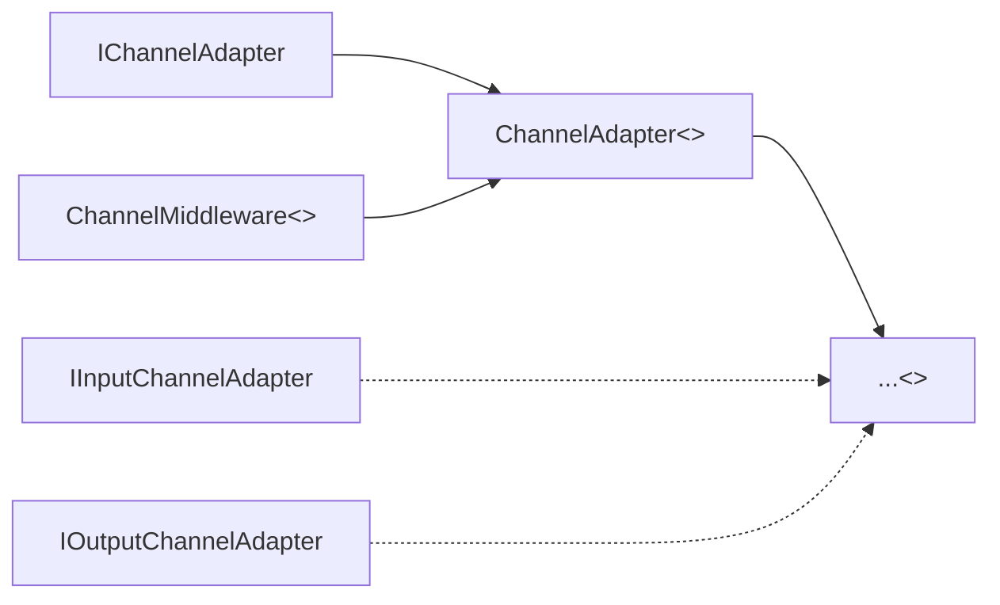
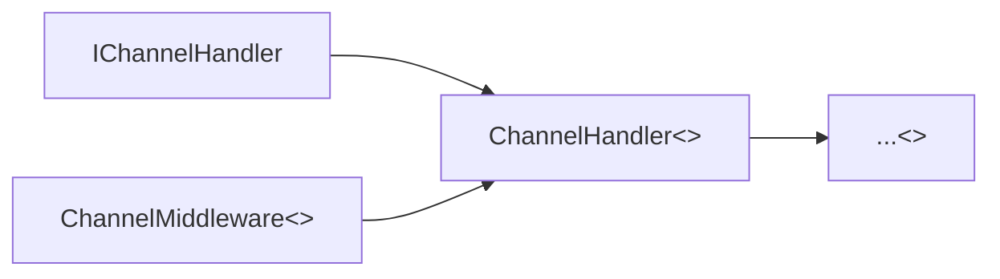
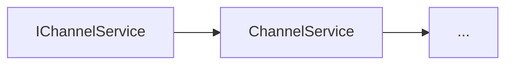

# Structure

This documents attempts to expose the class and interface structures.

## Channels

```mermaid
graph LR
    IChannel --> Channel
    ConnectedSocket --> Channel
    Channel --> ClientChannel
    Channel --> ServiceChannel
```

## Adapters

```mermaid
graph LR
    IA[IChannelAdapter] --> A[ChannelAdapter<>]
    M[ChannelMiddleware<>] --> A
    A --> X[...<>]
    IInputChannelAdapter -..-> X
    IOutputChannelAdapter -..-> X
```

## Handlers

```mermaid
graph LR
    IH[IChannelHandler] --> H[ChannelHandler<>]
    M[ChannelMiddleware<>] --> H
    H --> X[...<>]
```

## Channel Services

```mermaid
graph LR
    IChannelService --> S[ChannelService]
    S --> X[...]
```
